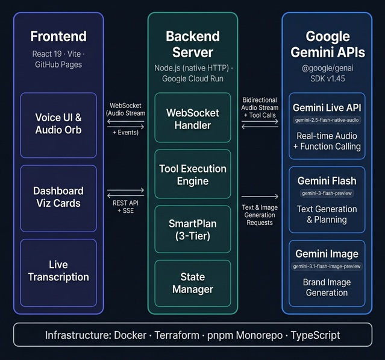

<div align="center">

# 🎙️ Tilly Live Ops

### Real-time voice agent for hospitality operations

*90% of people use only 10% of deep or complex platforms and their tools. Tilly changes that — breathing light into the darkest corners, making it easy, fast, and simple to find even the most hidden tools and use them properly. All in minutes, with no prior knowledge required.*

[](https://ai.google.dev/)
[](https://devpost.com/)
[](https://devpost.com/)

</div>

<br/>

## What This Is

Tilly Live Ops is a **pure-voice enterprise orchestrator**. An operator talks to Tilly through a real-time audio stream — entirely hands-free — and she translates that natural conversation into complex backend actions: live stock routing, loyalty point adjustments, staffing checks, and multimodal email generation. Actions execute silently in the background while the conversation keeps flowing.

This is **not a chatbot**. The centre of the experience is a live operations canvas with status panels, an action timeline, and animated visualisation cards that respond to natural voice conversation in real time.

> Built for the [Gemini Live Agent Challenge](https://devpost.com/) — **Competition Category:** Live Agents 🗣️ (Real-time Interaction)

<br/>

## Architecture

<div align="center">



</div>

### Dual-Layer AI Architecture

To achieve reliable, low-latency voice interaction with accurate backend execution, Tilly uses a dual-layer approach:

**The Voice Layer** — The Gemini 2.5 Flash native audio model handles real-time, bidirectional audio over WebSockets. This is Tilly's "mouth and ears" — she listens, responds naturally, and can trigger function calls (tool use) directly during the conversation.

**The Action Layer** — A secondary background text model handles structured JSON planning when additional intelligence is needed. This ensures backend actions execute accurately without interrupting the live audio stream. A dedicated image model generates branded email campaign visuals on demand.

### 3-Tier Detection System

The Gemini Live audio model does not always reliably call tools directly during native audio streaming, so Tilly uses a 3-tier detection system to maximise reliability:

1. **Tier 1 — function_call:** When Gemini does call a tool natively, it fires immediately. Tracked per turn to prevent duplicates.
2. **Tier 2 — Output-transcript matching:** Scans Tilly's spoken response for confirmation phrases and extracts dynamic data from the conversation.
3. **Tier 3 — Input keyword fallback:** Matches the operator's words directly. Info queries (drivers, stock, staff) fire immediately. Action queries (promotions, push notifications) wait for confirmation or specific detail.

All actions update the state via SSE — panels, action timeline, and centre-stage viz cards respond in real-time.

<br/>

## Demo Flow

A single continuous voice conversation during a live shift:

| Turn | Operator Says | Tilly Does |
|------|---------------|------------|
| 1 | *"Give me a quick operational rundown. Have all the drivers clocked in?"* | Driver and staffing panels update. Surfaces Driver 2 delayed by traffic, one delivery ~15 min behind. |
| 2 | *"Send the customer an automated SMS and drop 50 loyalty points into their wallet. Check stock in the prep kitchen — how's fresh dough?"* | Action rail shows SMS sent + loyalty credit. Inventory and kitchen panels update. Fresh dough at 20 portions, below Friday threshold. |
| 3 | *"Halt garlic bread prep to save dough for pizzas. Spin up a quick loaded fries promo."* | Kitchen panel shows garlic bread blocked. Marketing opens draft state. Tilly asks what kind of promo. |
| 4 | *"20% off QR code, push it to everyone with our app."* | Campaign drafted, push notification sent. Marketing panel confirms. |

<br/>

## Tech Stack

| Layer | Technology | Version |
|-------|-----------|---------| 
| Voice | Gemini Live API | `gemini-2.5-flash-native-audio-preview-12-2025` |
| Text + Image | Gemini 3.1 Flash Image | `gemini-3.1-flash-image-preview` |
| Backend | Node.js (native `node:http`) | Node 22+ |
| Frontend | React + Vite | React ^19.1.0, Vite ^6.3.5 |
| AI SDK | @google/genai | ^1.45.0 |
| Infra | Google Cloud Run | GitHub Actions |
| Design | CSS custom properties | Dark/light theme tokens |

<br/>

## Quick Start

```bash
pnpm install
cp .env.example .env   # Add your GOOGLE_API_KEY
pnpm dev
```

| Service | URL |
|---------|-----|
| Web UI | http://localhost:5173 |
| API Server | http://localhost:8787 |

### Environment Variables

All variables are documented in [`.env.example`](.env.example):

| Variable | Required | Default | Description |
|----------|----------|---------|-------------|
| `GOOGLE_API_KEY` | Yes | — | Gemini API key |
| `ALLOWED_ORIGINS` | No | `http://localhost:5173,http://127.0.0.1:5173` | Comma-separated browser origins allowed to call the API |
| `GEMINI_LIVE_MODEL` | No | `gemini-2.5-flash-native-audio-preview-12-2025` | Native audio model for real-time voice |
| `GEMINI_MODEL` | No | `gemini-3.1-flash-image-preview` | Text model for planning fallback |
| `GEMINI_IMAGE_MODEL` | No | `gemini-3.1-flash-image-preview` | Image generation model |
| `GOOGLE_CLOUD_PROJECT` | No | — | GCP project ID (for deployment) |
| `GOOGLE_CLOUD_REGION` | No | `europe-west2` | GCP region |
| `GOOGLE_GENAI_USE_VERTEXAI` | No | `false` | Use Vertex AI instead of API key auth |

<br/>

## Project Structure

```
apps/
  server/src/
    index.ts          — HTTP server, SSE broadcast, tool handler, 3-tier action detection
    liveSession.ts    — Gemini Live API session, audio streaming, function calling, transcripts
    gemini.ts         — GenAI SDK client, text-model planning path, brand image generation
    scenario.ts       — State engine, panel data, SmartPlan keyword + speech detection
    types.ts          — Snapshot, ActionItem, PlannedAction, PanelState
  web/src/
    App.tsx           — Single-component UI with voice orb, viz cards, and dashboard
    styles.css        — Design system with dark/light theme tokens
docs/                 — Architecture diagram and model references
```

<br/>

## Features

- 🎙️ **Real-time voice** — natural conversation via Gemini Live API, with interrupt and follow-up support
- 📊 **Live command surface** — operational panels (Drivers, Inventory, Kitchen, Marketing, Customers, Staff)
- 🎬 **Action visualisation** — animated centre-stage cards show actions in progress with live data
- 📧 **Multimodal email generation** — AI-generated branded campaign images from voice descriptions
- ⏱️ **Action timeline** — every action logged with status, timestamp, and detail
- 🌙 **Dark / Light theme** — full theme system via CSS custom properties
- 🔄 **Session resilience** — reconnection cooldown prevents cascading failures

<br/>

## Deployment

Cloud Run deployment is automated via GitHub Actions workflows in [`.github/workflows/`](.github/workflows/).

```bash
pnpm -r build
```

Before making the repository public, make sure deployment secrets stay in GitHub or Google Cloud and never in git-tracked files:

- Keep local credentials only in ignored files such as `.env`, `.env.local`, or other `.env.*` files
- Store `GCP_SA_KEY`, `GCP_PROJECT_ID`, and `GOOGLE_API_KEY` in GitHub repository or environment secrets
- Rotate any cloud credentials immediately if they are ever pasted into a tracked file or workflow log
- Run the **Public Release Audit** workflow (or let it run in CI) to scan the full git history for known secret patterns before publishing
- Prefer Vertex AI or Secret Manager-backed runtime configuration for long-lived production deployments when possible

<br/>

## Reproducible Testing Instructions

### Prerequisites

- **Node.js** 22+ ([download](https://nodejs.org/))
- **pnpm** 9+ — install via `corepack enable` (bundled with Node.js)
- **Google Gemini API key** — get one at [aistudio.google.com](https://aistudio.google.com/apikey)
  - Image generation requires a **paid** API key (pay-as-you-go billing enabled)
- **Microphone access** — the browser will request mic permission for voice interaction

### Setup

```bash
git clone https://github.com/TillTech/Gemini-Live-Agent-Challenge.git
cd Gemini-Live-Agent-Challenge
pnpm install
cp .env.example .env
```

Open `.env` and paste your Gemini API key:

```
GOOGLE_API_KEY=your-key-here
```

### Run Locally

```bash
pnpm dev
```

| Service | URL |
|---------|-----|
| Web UI | http://localhost:5173 |
| API Server | http://localhost:8787 |

### Step-by-Step Testing Walkthrough

> 💡 **Tip:** Use headphones with a microphone for best results. Tilly responds with real-time audio.

#### 1. Start a session
- Open http://localhost:5173 in Chrome
- Click the central **orb** — it will pulse and connect
- **Expected:** Tilly greets you by saying *"Good afternoon, I am Tilly. Who am I speaking with today?"*
- Say your name — Tilly will greet you and ask what you need help with

#### 2. Check operational status (voice command)
- Say: *"Give me a quick operational rundown"* or *"Check the drivers"*
- **Expected:** Dashboard panels populate on the left side with live data — driver statuses, delivery ETAs, and staffing information. A viz card appears centre-stage showing the results.

#### 3. Take an action (voice command)
- Say: *"Send the customer an apology SMS"* or *"Add 500 loyalty points"*
- **Expected:** A viz card animates in showing the action being taken. The action timeline updates with a timestamped entry.

#### 4. Draft an email campaign (voice command)
- Say: *"Can we send an email please?"*
- Tilly will ask for the offer details
- Say: *"20% off fish and chips this weekend, promo code FISH20"*
- **Expected:** An email campaign viz card appears with:
  - The subject line from your description
  - An **AI-generated branded image** (this takes a few seconds)
  - Draft status with approve/send actions

#### 5. Explore more features
- Try: *"Check stock in the prep kitchen"*, *"How are the kitchen stations?"*, *"Check today's rotas"*
- Try: *"Draft an SMS campaign"* or *"Send a push notification"*
- Toggle **dark/light theme** using the ☀️/🌙 button in the top bar
- Click **Reset** to clear the session and start fresh

#### 6. Verify the 3-tier detection system
The system uses three detection methods — you can observe them in the terminal logs:
- **Tier 1 (function_call):** Look for `[LIVE] Tool call received` in the server logs
- **Tier 2 (speech matching):** Look for `[TIER2]` log entries when Tilly confirms actions
- **Tier 3 (keyword fallback):** Look for `[TIER3]` entries for direct keyword matches

### Troubleshooting

| Issue | Fix |
|-------|-----|
| No audio / Tilly doesn't speak | Check browser mic permissions. Use Chrome for best WebAudio support. |
| Session disconnects after tool call | Known intermittent issue with the preview model. Click the orb to reconnect. |
| No image in email card | Ensure your API key has pay-as-you-go billing enabled for image generation. |
| `pnpm: command not found` | Run `corepack enable` first (requires Node.js 22+). |

<br/>

## Data

This project uses **synthetic demo data** shaped to reflect real hospitality workflows. No private customer, financial, or production data is included.

<br/>

## Project Background

Inspired by [TillTech](https://till.tech)'s real-world hospitality operations platform. We've spent the last decade building a comprehensive business platform, but we realised that powerful tools are often underutilised due to UI complexity. This project rethinks the user experience entirely, positioning voice as the stepping stone into the future of business management.

Tilly is actually a slice of a much deeper stack — an orchestrator-based system with field-relative experts and specific action sub-agents. For this hackathon, we wanted to showcase how you can take this conversational orchestrator approach and use it to take meaningful, complex actions within your business.

See also:

---

<div align="center">

*Built with the Gemini Live API for the Gemini Live Agent Challenge*

</div>
